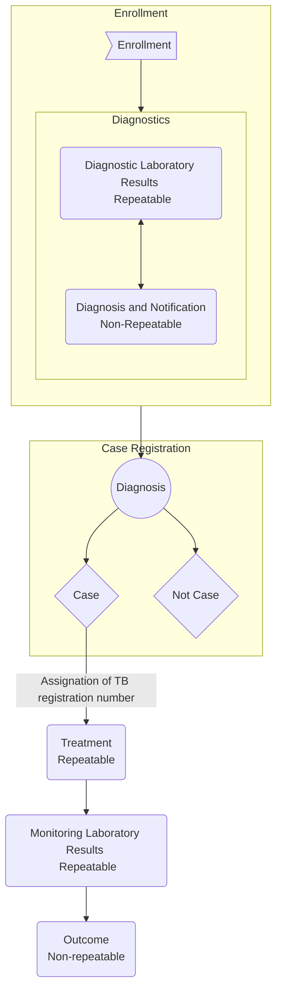

# TB Case Surveillance - System Design Document { #tb-cs-design-300 }

```mermaid
%%{init: {'mirrorActors': false } }%%

flowchart TD
  id1>Enrollment]
  id2(Diagnostic Laboratory Results <br> Repeatable)
  id3(Diagnosis and Notification <br> Non-Repeatable)
  id4((Diagnosis))
  id5{Case}
  id6{Not Case}
  id7(Treatment <br> Repeatable)
  id8(Monitoring Laboratory Results <br> Repeatable)
  id9(Outcome <br> Non-repeatable)
  subgraph Enrollment
    direction TD
    subgraph Diagnostics
       direction TD
       id2 <--> id3
    end
    id1 --> Diagnostics
  end
  subgraph Case Registration
    direction TB
    id4 --> id5
    id4 --> id6
  end
  Enrollment --> id4
  id5 -- Assignation of TB registration number --> id7
  id7 --> id8
  id8 --> id9
  
```
