# TB Case Surveillance - System Design Document { #tb-cs-design }

## Introduction

The **TB Case Surveillance Tracker (TB-CS) digital data package for DHIS2** is based on the [WHO recording and reporting framework](https://apps.who.int/iris/handle/10665/79199) from 2013. It provides a set of recommended metadata (data elements, program rules, etc) to enable electronic capture of individual/case-based TB surveillance data. The tracker metadata is configured to ensure that aggregated standard quarterly TB report indicators on notifications, first-line outcomes and second-line outcomes as defined by the WHO Definitions and reporting framework for TB (2013) can be automatically generated from the individual data captured. The TB Case Surveillance Tracker is not intended to support patient management or patient care. This requires more detailed analysis of roles, responsibilities, workflows and decision-making within the settings in which such systems would be implemented.

The system design document explains how the tracker program was configured to meet the data entry and analysis requirements and support a typical workflow. The document does not include an exhaustive listing of all metadata captured. This document also does not consider the resources and infrastructure needed to implement such a system, such as servers, power, internet connections, backups, training and user support. More information on the TB programme technical aspects informing this system design is available in the [WHO publication on electronic recording and reporting for tuberculosis care and control](https://apps.who.int/iris/handle/10665/44840). Supplementary implementation guidance for DHIS2 can be found in the [General DHIS2 Implementation Guide](https://docs.dhis2.org/en/implement/configuring-the-android-app/about-this-guide.html) and [DHIS2 tracker implementation guide](https://docs.dhis2.org/en/implement/understanding-dhis2-implementation/a-quick-guide-to-dhis2-implementation.html).

## System Design Overview

### Background

Reliable epidemiological data is required for staff at all levels of a national TB programme to plan and provide effective tuberculosis care and control services, as well as monitor the performance of programmatic actions. A case-based surveillance system has clear advantages over an aggregate data collection system. Like an aggregate surveillance system a minimum set of epidemiological indicators can be captured, validated, aggregated, calculated and displayed but these can be disaggregated by any combination of time, location/area, age, sex, case type, previous treatment history, HIV status, drug resistance status and treatment regimens. This helps us to understand TB epidemiology in depth and monitor changes over time.
It is expected that case-based electronic data will result in **improved data quality** because the number of data entry steps are reduced, automatic calculations and validations can be built into the system, inconsistent, erroneous or incomplete data can be corrected or completed rapidly for an individual record and de-duplication can be carried out to remove duplicate records. A case-based surveillance system should also allow the linking of surveillance records to the same case even if a TB case is transferred or referred between facilities during the course of treatment.
See principle 2.4, page 16, of [**Policy on the Protection of Personal Data of Persons of Concern to UNHCR**](http://www.refworld.org/docid/55643c1d4.html).

### Use Case

The TB Case Surveillance Tracker enables **registration and longitudinal tracking of TB cases from the point of notification to final case outcome, inclusive of laboratory results**. The program captures a minimum set of data points required for epidemiological analysis of case surveillance data as described in the background section. These include baseline and demographic information about the case, risk factors, laboratory results for diagnosis and routine check-ups, drug resistance type classification, treatment regimens provided, and case outcome. **This tracker program is not designed to support clinical management nor patient care**. Rather, the program serves as an electronic registry that supports decentralized electronic data capture of case surveillance data down to health facility and laboratory levels.

## Program Structure

The revised TB CS tracker program has been designed to reflect a **more generic workflow** able to integrate data entry both from the health facility side (e.g. clinicians and nurses), and the laboratory side. Workflows in countries may vary and the case surveillance program should be adapted as needed to local context.

> **IMPORTANT**
>
> Please note that given the generic design of the tracker, this system design guide contains throughout the sections useful information, considerations, and justifications that can be of great importance for the implementation. The document should therefore be thoroughly revised both by the requesting and implementing parties.

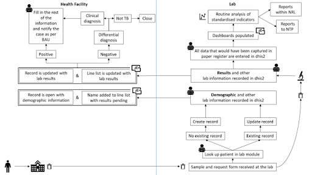

Following this initial workflow, the program has been structured as follows:

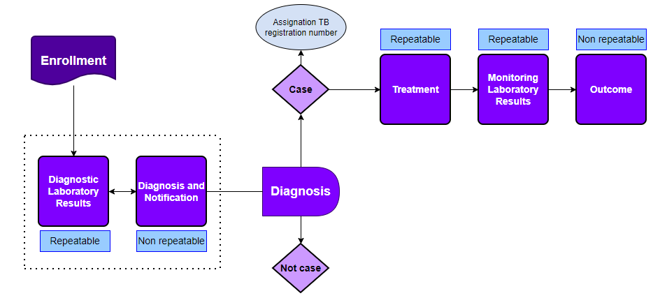

### Rationale for Program Structure

The design of the tracker has been improved to expand the information that could potentially be collected from the laboratory side. The expansion touched of course the metadata, which is now more comprehensive and allows to **discern between diagnostic and monitoring tests**, but it also created a more generic baseline upon which implementers and countries could build their own workflow. Depending on the local needs, the “Diagnostic laboratory results” and the “Diagnosis and notification” stages could have different orders; depending on the local resources and connectivity, the data entry could be centralized or decentralized between the laboratory and the health facility; depending on the local data flow, the data could be entered live or retrospectively.

In particular, there could theoretically be **three general scenarios** that could change the flow and the order of the stages:

1) **The laboratory staff receives the tests requests and the “Diagnostic Laboratory Results” is the very first step** in the journey of the suspected case upon their enrollment. This scenario represents the theoretical work flow and should be the target to which countries should aim in the long-term investment in the digitalization of routine health data.

   - In this case the “Enrollment” and “ Diagnostic Laboratory Results” stages are completed directly by the laboratory staff. The “Diagnosis and notification” stage can then occur in parallel or after the registration of the laboratory results. At this point the case can either become an official TB case, in which case they will have to receive a TB registration number in their enrollment stage, or they will receive negative laboratory results and be denotified.

2) **The suspected case gets enrolled and registered from the clinical side of the workflow before the samples are sent to the laboratory.**

   - In this case the “Enrollment” and the “Diagnosis and notification” stages are completed first.
   - The “Diagnostic Laboratory Results” gets completed by the laboratory staff.
   - The clinicians will complete the “Diagnosis and notification“ stage confirming or not their diagnosis and notifying the case if necessary. If the latter happens, the clinician will have to reopen the “Enrollment” and assign a TB registration number to the now-confirmed case.

   Please note that scenarios 1 and 2 are based on the assumption that the laboratory staff has the capacity to enter the data in the system locally and directly in their own facility.

   Should this capacity be inadequate for the local context, then scenario number 3 would occur:

3) **The data entry is centralized and there is no differentiation between laboratory and clinical staff** - the data entry relies on one (or multiple) data encoder.
In this case the stages should be arranged in order to match the local flow of information and data.

Independently from the best fitting scenario for a defined local context,**the adaptation of the tracker workflow and its stages should also take in consideration whether the data entry will occur in real time or if it will rely on batch retrospective data entry**.

## Intended Users

This document is intended for audiences responsible for implementing TB data systems and/or HMIS in countries, including:

- **System admins/HMIS focal points**: those responsible for installing metadata packages, designing and maintaining HMIS and/or TB data systems
- **TB program focal points** responsible for overseeing data collection, management, analysis and reporting functions of the national TB programme
- **Implementation support specialists**, e.g. those providing technical assistance to the TB programme or the core HMIS unit to support & maintain DHIS2 as a national health information system and/or TB data system

## Tracker Program Configuration

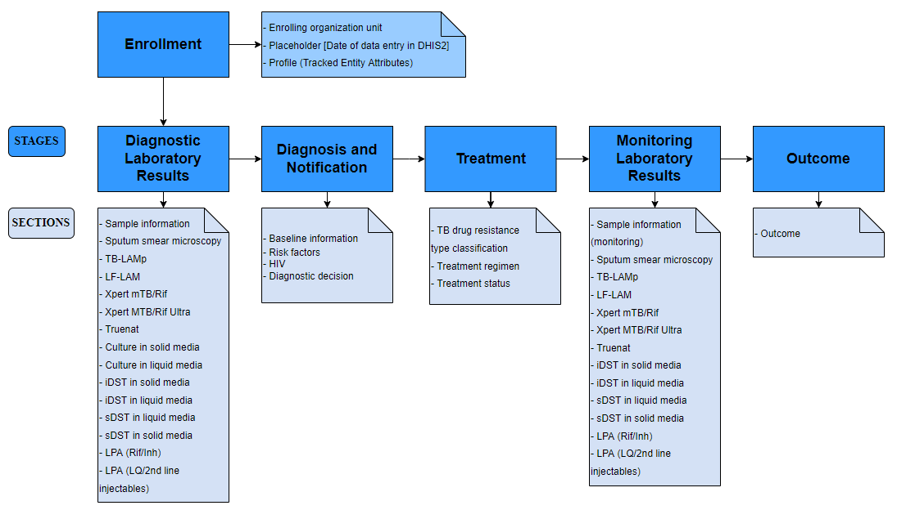

| **Structure**                    | **Description**       |
|-------------------------------|----------|
| **Enrollment**                    | The stage collects the basic TEI attributes. Please note that some of the attributes show the “GEN - “ prefix. To know more about the [**Common Metadata Library**](https://docs.dhis2.org/en/topics/metadata/dhis2-who-digital-health-data-toolkit/common-metadata-library/design.html), please refer to the link provided. The stage is non-repeatable.      |
| **Diagnostic Laboratory Results** | In order to display the whole list of tests available for **diagnostic purposes**, the user should report first the “Sample information” section. **The stage is repeatable**. The repeatability was set to allow countries to implement the tracker as per the local workflows and preferences - depending on whether there is the need to track ALL the samples (good and bad quality) or just the “good” samples, the stage can be repeated accordingly. |
| **Diagnosis and notification**                  | The stage collects the baseline information, the risk factors, the potential HIV (co-)infection, and the diagnostic decision. The decision-maker will either **diagnose a suspected case with TB and notify** them, or will confirm the absence of infection. **SMS templates** for notifying the cases or confirming the absence of infection are included in the metadata package. **The stage is non-repeatable**.                                    |
| **Treatment**                     | The stage collects the information necessary for the overview of the **patient’s regimen** and status during their course of treatment. **The stage is repeatable** but limited to two events and one treatment regimen change.    |
| **Monitoring Laboratory Results** | In order to display the available tests for monitoring purposes (sputum microcopy and culture tests), the user should report first the “Sample information” section. The stage only displays the tests used for **monitoring confirmed cases** rather than all the tests that can be requested for the follow-up of the patient. The stage will display just the sputum microscopy for cases on fist-line treatment regimen, while will add the culture to teh microscopy for DRTB patients.  **The stage is repeatable**.    |
| **Outcome**                       | The stage collects the final outcome of a confirmed case. In this stage the patients can be denotified if they result not being a TB case or in order to remove a duplicate enrollment.  **The stage is non-repeatable**.   |

### Stage Details

#### Enrollment

When a client is enrolled in the TB case surveillance as a tracked entity instance (TEI), TEI attributes are recorded to form the case profile.

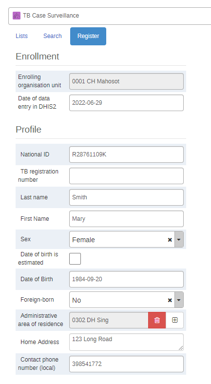

**The enrollment date has been set up as a placeholder** allowing the users to utilize it according to the needs of implementation. It can be used as date of registration in DHIS2 or as date of first consultation, visit or investigation. When enrolling confirmed TB cases only, it is possible to keep using enrollment date as date of diagnosis. In this case, the Laboratory tracker should be isolated from the TB case surveillance module and set up as a separate program.

**Note that the TB registration number has been left empty**. If the data entry is occurring in real time, at this stage the clinician/data entry operator cannot know whether the suspected case is confirmed or not. The users will have to reopen the enrollment and assign to the confirmed patient a registration number after having received the diagnostic laboratory results.

If the data entry is retrospective and done in batch, the data encoder will already know whether the patient has been confirmed or not, and will be able to already assign a registration number accordingly. For this reason the TB registration number has not been set as a compulsory attribute.

Upon the completion of the enrollment, the **landing page for the next stages appears blank**. This has been set for countries to be able to implement the tracker according to their own work flows as described in the “Rationale for Program Structure” chapter of this guide.
The next stages can therefore be the “Diagnostic Laboratory Results” or the “Diagnosis and notification” stages, either in this order, or in the opposite order.

#### Diagnostic Laboratory Results

The full list of diagnostic tests will automatically appear only if the sample is flagged as received and if the quality is good.
The stage includes the following tests:

- Sputum smear microscopy;
- TB-LAMP;
- LF-LAM;
- Xpert MTB/RIF;
- Xpert MTB/RIF Ultra;
- Truenat;
- Culture in solid media (e.g. LJ);
- Culture in liquid media (e.g. MGIT);
- Initial phenotypic DST in solid media (e.g. LJ);
- Initial phenotypic DST in liquid media (e.g. MGIT);
- Subsequent phenotypic DST in solid media (e.g. LJ);
- Subsequent phenotypic DST in liquid media (e.g. MGIT);
- First-line LPA;
- Second-line LPA

As an example of the data entry for two of the tests:

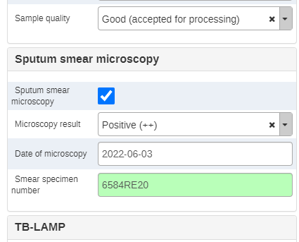

**Date of test results** (including inoculation date for culture tests) has to be provided for each test. The purpose of this is to:

- assign the test event to the right period of time in analytics;
- help monitoring the delay between reception and result dates.

The suggested design of the diagnostic laboratory stage is to enter final valid test results only.

**Examples:**

- 1 sample - 1 microscopy test:
Record test results for the applicable test in the data entry form.

- 1 sample - 1 microscopy and 1 Xpert MTB/RIF test:
Record microscopy and Xpert MTB/RIF results in the data entry form.

- 1 sample - 2 repeated microscopy tests, where test 1 is invalid and test 2 is valid:
Record results of test 2 (valid test result) in the data entry form.

This recommendation minimizes the data entry workload, and aligns with the basic requirement of not using tracker as a lab management tool.

If locally there is a need to monitor the workload of the lab outside the local lab management system, it is possible to add a data element in each test section and record the number of tests that had to be run before receiving a final result.
If the local needs request a more detailed collection of samples tested independent of the results, the tracker could be uptaken to record multiple tests per sample and per case.

**Implementers should therefore investigate the analytic needs of the implementing country and adjust the indicators related to the number of tests and results accordingly.**

#### Diagnosis and Notification

According to current tracker design, the Diagnosis and Notification event may be created before or after the Diagnostic laboratory Results event.

**The Diagnosis and Notification event date is a placeholder** that can be utilized according to the implementation needs. It can be used as the date of initial visit, consultation or sample collection.

> **IMPORTANT**
>
> If data entry is happening based on paper forms or data import, and the event date is used as date of data entry in DHIS2, there is a chance that the registration event will appear after other events in the timeline, which may be misleading for users.

The registration stage provides an overview of the baseline information, the eventual risk factors, whether the suspected case is HIV(+), and, most importantly, the section on diagnostic decisions.

The system will **automatically provide a warning message with the definition of the selected history of previous treatment**. The definitions have been set as per the WHO global guidelines and should be adapted to the local context.
A question on whether the patient has ever received 2nd line treatment before will appear should “Relapse”, “Treatment after failure or LTFU”, or “Other previously treated” is selected as history.

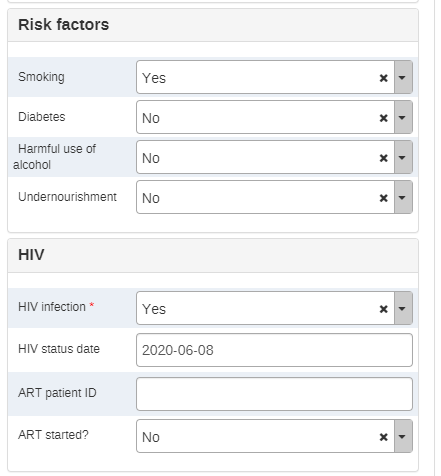

In case of confirmed seropositivity of the patient the system will prompt an expansion of the HIV information and will request the date of the last test and whether the patient is enrolled in an ART cohort. If the latest HIV test date is **older than 6 months** from the date of diagnosis, a warning message will prompt the clinician to schedule another HIV test for the patient.

At this point, if the laboratory results are available, the clinician/data entry clerk should be able to report the diagnostic decision.

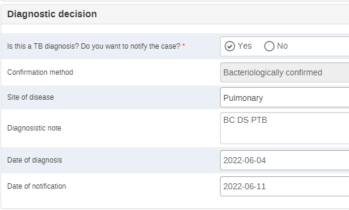

Once **the case is notified**, the user needs to fill in the fields in the Diagnostic decision section.

If positive laboratory test results are available and entered in the “Diagnostic Laboratory Results” stage, **bacteriological confirmation will be assigned automatically**. If the local guidelines require the clinician to enter this information manually, the PRs linked to the confirmation method can be removed.

A **notification is sent to the patient** if the “Notify the case?” checkbox is clicked, the diagnosis, date of diagnosis, the notification date and the patient’s telephone number are recorded in the system.

If the test results are negative but the case is **diagnosed clinically**, the patient can be notified as “clinically diagnosed”.

If the laboratory **results are negative and no notification is necessary**, the user should tick “NO” in the “Do you want to notify the case?”. This was the case is excluded from analysis of TB cases. **An SMS is sent to the patient if the patient is not diagnosed**

Independently from whether the diagnosis is positive (laboratory- or clinically-derived) or negative, the tracker presents two key dates: date of diagnosis and date of notification. The former is the date when the patient was diagnosed, while the latter is teh date on which they received the notificatin of their status. Although the use of these dates might be subject to change depending on the implementation, it should be noted that the period boundary for the PIs counting notifications (e.g. All TB cases notified), is based on the fate of diagnosis as per WHO guidelines. 
The primary purpose behind the inclusion of the date of diagnosis and the date of notification within the system is to facilitate future analysis and potential applications. For instance, these timestamps can serve as valuable metrics for evaluating service quality and ascertaining the efficiency with which healthcare facilities promptly inform patients.

Once a presumptive case is bacteriologically confirmed or clinically diagnosed, they should receive a **TB registration number**. This information is also highlighted as a **reminder in the Feedback** window on the top right corner of the data entry screen just above the enrollment information. The clinician/data entry clerk should therefore reopen the enrollment window and assign a TB registration number according to the national guidelines. Although the default configuration leaves this space blank and editable, implementers might want to consider if an automatic assignment of a number (or alphanumeric sequence) would be appropriate as per the local workflow.

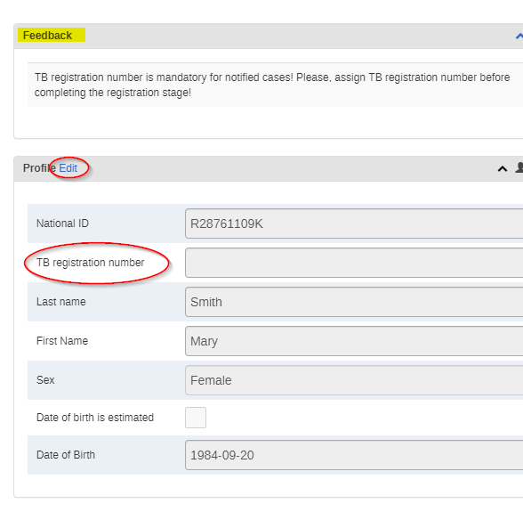

The same info will also appear as an **error message** under the “Date of diagnosis” as a reminder to assign a Tb registration number to the newly identified case.

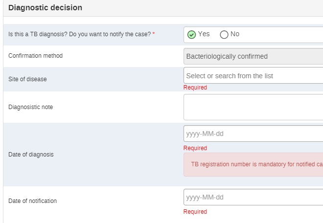

#### Treatment

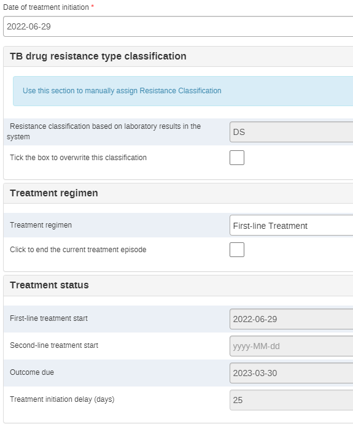

In this stage the clinician/data entry clerk will report the **regimen of the patient** - 1st or 2nd line treatment. As the tests did not detect any resistance, the patient is automatically assigned the DS (drug susceptible) option. The clinician can tick the box in the section to overwrite the automatic assignment and manually assign the right classification according to their clinical opinion. The automatic classification could also be completely removed, which will in turn compel the clinician to manually assign a classification based on the laboratory results for every patient. 
The treatment end date should be applied only if it is needed to overwrite the current treatment - e.g. the patient needs to be put on 2nd line from 1st line treatment regimen. The decision of being able to change the treatment rather than the notification and diagnosis stage was taken in odrder to have more flexibility in case of mistakes and to keep the history of the patient rather than overwriting and removing the past diagnoses.

The date of treatment initiation (event date) is important for the calculation of the delay between diagnosis and the debut of the treatment.
The Treatment Status section contains **automatically assigned standard calculations of treatment durations and treatment initiation delays in days**.
The event due date is configured with the description ‘expected date of outcome. By default, the **due date for the outcome section is scheduled for 180 days after the date of treatment initiation - this is to be considered as a placeholder and the 180 days threshold should be replaced with whichever period is defined in the national guidelines.**
The Outcome stage due date may be changed manually, but can only be rescheduled once. For a user, this may be done after Treatment has been initiated and the DE in the Treatment stage ‘Outcome Due’ has been generated. When an Outcome stage is overdue (the current date is later than the calculated DE ‘Outcome due’ from the Treatment stage, a message is displayed in the Feedback Widget.

#### Monitoring Laboratory Results

The structure of the monitoring stage is **virtually identical to the diagnostic laboratory stage**. The main difference is the list of tests - the monitoring lab stage includes only the ones that are relevant for monitoring purposes. Please note that if the patient is flagged as DS (drug susceptible), only the microscopy test will automatically appear in the monitoring lab stage as per WHO guidelines. As aforementioned, should the patient be a DRTB case, the list of tests will also display the cultures in solid and liquid media.

#### Outcome

As aforementioned, the outcome stage is a **non repeatable stage** where the confirmed positive cases end their treatment.
Depending on the amount of time passed since the enrollment, the clinician/data entry clerk can select all the outcomes or only the outcomes that can be acceptable within a given time.

- If the outcome for the patient is registered within 6 months from their diagnosis, the only available options will be “dead” and “LTFU”.
- Above the 6 months threshold, the outcomes list expands and also includes the “cured”, “not evaluated” and “completed” options.
- The “failed” outcome can only be entered 5 months after the date of diagnosis.

**The number of months has been set as placeholder** while following the global guidelines, though the value should be updated according to the relevant national guidelines. Every outcome will automatically display a warning box with the definition of the chosen option. The definitions follow the standard explanation detailed in the WHO guidelines. Similarly, the definitions should also be replaced or expanded based on the ones present in the national guidelines.

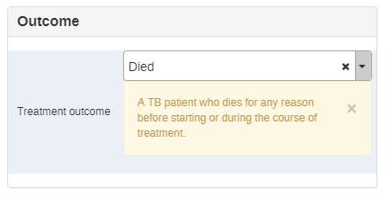

The outcome can also be used to denotify a case. A denotification is applied if a suspected patient is not a case, or to remove a duplicate enrollment. Removed duplicates will not be considered nor counted towards the total reports, though the number of denotified duplicates will be available in order to monitor the quality of the data and of the data entry.

## Additional Features

### Real Time Notifications

Should the system be used for real time data entry and surveillance, there are four predefined notifications in the default configuration of the tracker. These can and should be customized to better mirror the local context and needs.

- **TB CS - Case notification** - this SMS notification is sent to the presumptive case by alerting the recepient that the lab results are available and he/she should contact the health facility. The notification is sent only if the phone number of the presumptive case and the notification date have a valid value.
- **TB CS - Poor sample quality notification** - this is an internal system notification sent to the TB Admin user group whenever a sample that was received at the lab does not meet the quality standards for processing and is registered as “bad quality”. The notification should prompt the clinician to collect another sample from the same case for either diagnosis or monitoring purposes.
- **TB CS - De-notification (presumptive case)** - this SMS notification is sent to the presumptive case prompting him/her to contact the health facility. The notification is triggered only if the case is denotified from the “Outcome” stage and the phone number of the case was registered at enrollment.
- **TB CS - Denotification (notified case)** - this SMS notification is sent to a already notified case who was mistakenly notified due to double data entry or any other human or system error.

### Constants

The package includes a **set of tests and a list of drugs that can be modified** by the implementing country according to national context (e.g. which drugs and tests are used/available in the country). The use of constants enables a system admin in an implementing country to easily _‘turn on’ or ‘turn off’_ types of drugs and tests depending on availability in the country. When the complete package is installed into a DHIS2 instance, all data elements for all tests and drugs included in this package are included in the system. By default, all constants are set to ‘1’ (enabling the related data elements for data entry) and can be configured to ‘0’ by an implementer or system admin according to country context if not needed (disabling the related data elements for data entry). If a test or drug later becomes available in the country, an admin can simply re-enable the data elements by changing the constant from a value of ‘0’ to a value of ‘1’.

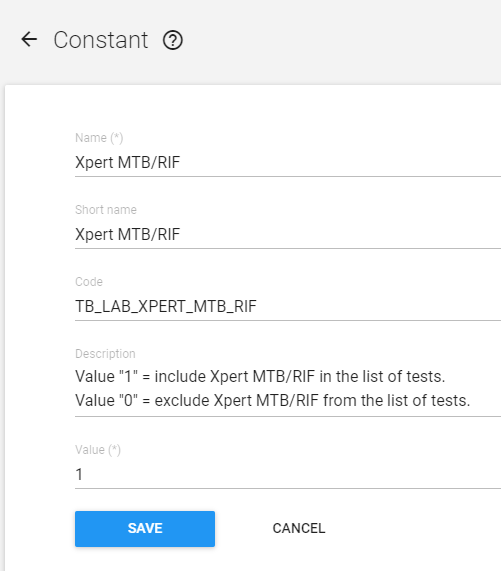

### Top Bar Widget

The top bar widget **can be either displayed or hidden**. In the default configuration of the tracker, the top bar is visible and configured to display the relevant information in the following order: 1) date of diagnosis, 2) TB registration number, 3) months since diagnosis, 4) patient’s age (months). 5) patient’s age (years), 6) HIV status, 7) resistance classification (at diagnosis), 8) case classification, 9) treatment regimen, and 10) resistance.

The order, the amount of info to be displayed, and the variables to display can be customized locally.

### Feedback Widget

Upon the completion of the enrollment process, the feedback text box will be displayed and available on the **top right corner of the screen**. Just like the other widgets, t**he feedback box can be removed**, though in the default configuration of the tracker it is displayed and used to flash important messages and notes to the user entering the data.

## Analytics

### Program Indicators

The full list of program indicators and indicators is available in the [metadata Reference File](resources/tb_cs-metadata.xlsx).

### Reporting Case-based Data into Aggregate TB Reports

The TB case-based surveillance tracker captures data that can be fed into standard, aggregate reporting (i.e. monthly, quarterly, or more frequently as determined by the country). An aggregate TB system design in DHIS2 can be accessed at who.dhis2.org/documentation/#tb.

The package includes 2 groups of program indicators that are mapped to the corresponding data elements and category option combinations of the data sets in the TB aggregate package.

The current TB CS tracker supports data transfer for the following data sets:

- TB - Case notification (quarterly)
- TB - RR/MDR-TB case detection and treatment (yearly)
- TB - Treatment outcomes (quarterly)
- TB - Treatment outcomes - second line (yearly)
- TB - Laboratory (monthly)

The mapping is based on codes of metadata objects. The process of data transfer is described in the installation guide.

### Program Rules

Program rules are used extensively in the TB Case Surveillance tracker to show/hide data elements to optimize the data entry form, show warnings/feedback to the data entry user and autocalculate & assign data values to data elements. A complete list of program rules can be found in the metadata reference file.

## Dashboards

TB Case surveillance tracker version 2.0.0 includes a dashboard for monitoring TB sample processing and test results (**TB-LAB - Laboratory**) summarizing the key indicators for the monitoring of the laboratory activities (volumes test, cases, or samples, positivity rates, turnaround times, and results).
The dashboard presents first the overall data for any test type and is then sectioned by test type (smear microscopy, GeneXpert, GeneXpert Ultra, and culture tests - solid and liquid media). The sections are labeled with a text box indicating the test type. Depending on the local context, type of implementation, and test availability, the dashboard can and should be adapted to better mirror the implementation’s needs.
Moreover, **should the TB Case surveillance tracker be used as a standalone module without aggregate data transfer, it is possible to utilize the existing indicators and configure custom visualizations and dashboards**.

## User Groups

The following user groups are included in the TB Case Surveillance Tracker Package:

- TB Admin: can edit/view metadata; no access to data [all program stages]
- TB Data capture: can view metadata, can capture data [all program stages], no access to dashboards
- TB Access: cam view metadata, can view data [all program stages]
- TB lab access: cam view metadata, can view data [? program stages], access to laboratory dashboards
- TB lab data capture: can view metadata, can capture data [TB registration and Laboratory stages]

## References

**UN High Commissioner for Refugees (UNHCR)**, (2015). Policy on the Protection of Personal Data of Persons of Concern to UNHCR. URL: <https://www.refworld.org/docid/55643c1d4.html> [accessed 20 July 2022]

**World Health Organization**, (2013). Definitions and reporting framework for tuberculosis – 2013 revision (updated December 2014 and January 2020). URL: <https://apps.who.int/iris/bitstream/handle/10665/79199/9789241505345_eng.pdf?sequence=1&isAllowed=y> [accessed 20 July 2022]
